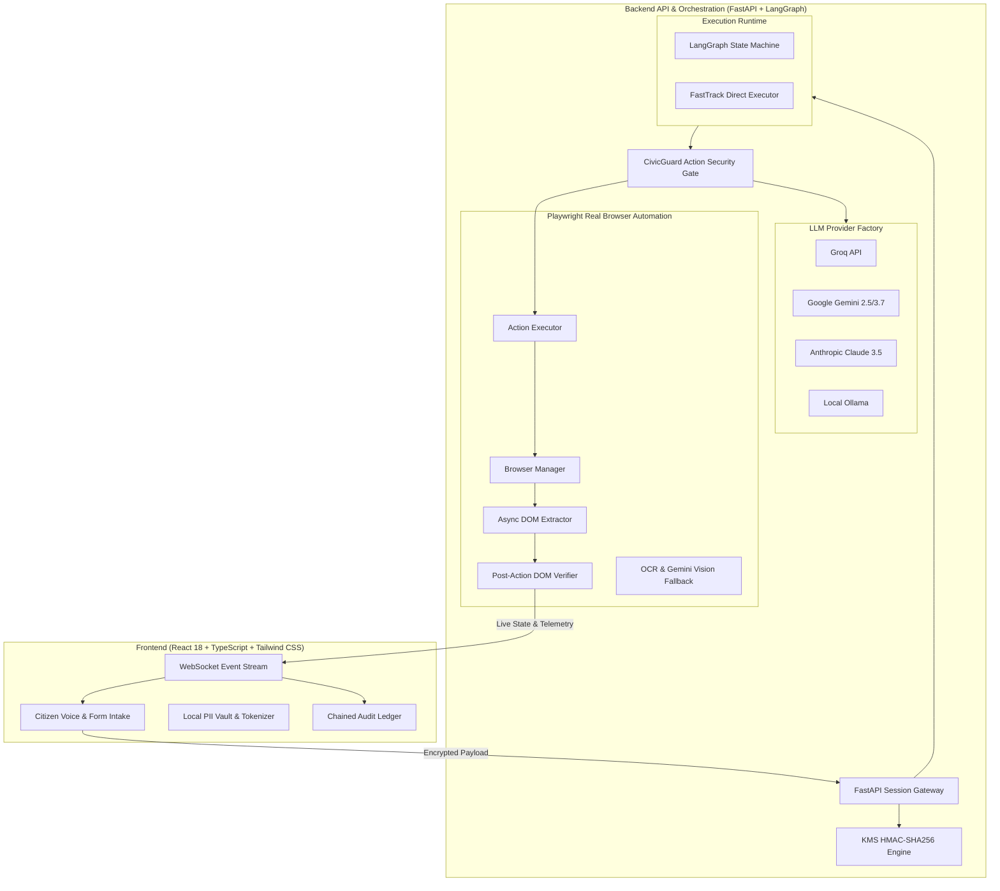

# 🏛️ CivicFlow — Verifiable Agentic Public-Service Automation

[](https://www.python.org/)
[](https://fastapi.tiangolo.com/)
[](https://react.dev/)
[](https://www.typescriptlang.org/)
[](https://playwright.dev/)
[](https://langchain-ai.github.io/langgraph/)
[](https://opensource.org/licenses/MIT)

> **CivicFlow** is an enterprise-grade, secure, and verifiable AI agentic platform designed to automate complex citizen interactions across official government and municipal portals. Powered by a **LangGraph state machine**, **Playwright browser automation**, **pluggable LLM providers**, **multilingual voice intake**, and **CivicGuard cryptographic tamper-evident security**, CivicFlow bridges accessibility, speed, and statutory compliance.

---

## 📑 Table of Contents

- [Key Highlights](#-key-highlights)
- [System Architecture](#-system-architecture)
- [Comprehensive Feature Index](#-comprehensive-feature-index)
  - [1. Agentic Workflow Engine (LangGraph + Fast-Track)](#1-agentic-workflow-engine-langgraph--fast-track)
  - [2. Playwright Real-Browser Automation](#2-playwright-real-browser-automation)
  - [3. CivicGuard Security, KMS & Cryptographic Integrity](#3-civicguard-security-kms--cryptographic-integrity)
  - [4. Voice-First Multimodal Citizen Intake](#4-voice-first-multimodal-citizen-intake)
  - [5. Multilingual Localization (12+ Languages)](#5-multilingual-localization-12-languages)
  - [6. Explainable AI (XAI) Terminal & Live Telemetry](#6-explainable-ai-xai-terminal--live-telemetry)
  - [7. Certified Government Portal Catalog](#7-certified-government-portal-catalog)
- [Execution Modes](#-execution-modes)
- [Project Directory Structure](#-project-directory-structure)
- [Getting Started](#-getting-started)
  - [Prerequisites](#prerequisites)
  - [Backend Setup](#backend-setup)
  - [Frontend Setup](#frontend-setup)
- [Environment Configuration](#-environment-configuration)
- [Testing & Quality Assurance](#-testing--quality-assurance)
- [Security & Compliance](#-security--compliance)

---

## 🌟 Key Highlights

- 🧠 **Dual Execution Runtime:**
  - **LangGraph State Machine:** Dynamic reasoning loop (`observe` $\rightarrow$ `analyze_and_decide` $\rightarrow$ `should_continue` $\rightarrow$ `act` $\rightarrow$ `verify`) with multimodal vision fallback.
  - **Fast-Track Engine:** Zero-LLM latency, deterministic Playwright execution for pre-certified government workflows.
- 🔒 **Zero-Trust Security (CivicGuard):**
  - Local PII tokenization (AES-256-GCM / AWS KMS envelope format).
  - SHA-256 and HMAC-SHA256 cryptographic session fingerprinting.
  - Strict `ActionSecurityGate` enforcing workflow contract permissions and unobserved element filtering.
  - Human-in-the-Loop (HITL) step-level approval for critical state mutations.
  - Real-time prompt injection and jailbreak defense scanning.
- 🎙️ **Voice-First Accessibility:**
  - Interactive speech input with real-time feedback and Indian English (`en-IN`) acoustic tuning.
  - Intelligent date normalization converting natural spoken/written formats (`20th August 2006`, `20/08/2006`, `20-08-2006`) into ISO `YYYY-MM-DD`.
  - Whisper API transcription fallback.
- 🌐 **Pluggable LLM Architecture:** Hot-swappable providers: **Groq (Qwen 3.8 / Llama 3.3)**, **Google Gemini (2.5 Flash / 3.7 Flash)**, **Anthropic Claude**, **Ollama (Local LLMs)**, and **xAI Grok**.
- 📜 **Tamper-Evident Audit Ledger:** Cryptographic hash-chained blockchain-like event log recording every agent action, selector, confidence score, and human sign-off.

---

## 🏗️ System Architecture



---

## 🔍 Comprehensive Feature Index

### 1. Agentic Workflow Engine (LangGraph + Fast-Track)

- **LangGraph State Graph (`backend/app/runtime/engine.py`):**
  - **`observe`:** Launches browser (if needed), loads portal URL, extracts interactive DOM elements (inputs, selects, buttons, testids). Automatically deduplicates extraction by reusing verified post-action DOM states.
  - **`analyze_and_decide`:** Formulates context-aware decision prompts (goal + history + DOM + PII tokens) and calls the active LLM provider.
  - **`should_continue` Router:** Determines whether to advance to `act`, trigger `vision_fallback`, await `user_confirmation` (HITL), or terminate on `COMPLETE`.
  - **`act`:** Executes validated actions in Playwright, runs post-action verification, updates telemetry logs, and chains state.
  - **`vision_fallback`:** Captures full-page screenshots, executes Tesseract OCR and Multimodal Gemini Vision reasoning when DOM state confidence is low.
- **Fast-Track Direct Engine (`backend/app/runtime/fasttrack.py`):**
  - Zero-latency deterministic execution engine for certified workflows.
  - Bypasses LLM inference while maintaining full terminal logging, DOM validation, and WebSocket event telemetry.

### 2. Playwright Real-Browser Automation

- **Async Headless & Headed Browser Control:** Chromium execution with configurable slow-mo, viewport resolution, and Proactor event loop integration on Windows.
- **Robust Locator Strategy (`backend/app/browser/action_executor.py`):**
  - Multi-tier selector resolution: `data-testid` $\rightarrow$ `#id` $\rightarrow$ `[name="..."]` $\rightarrow$ text match.
  - Safe element visibility verification using `.nth().is_visible()` iteration.
  - Automatic scrolling into view, focus management, and keyboard typing.
- **Universal Datepicker Handling:**
  - Automatic conversion of various user date formats (`DD-MM-YYYY`, `DD/MM/YYYY`, `YYYY-MM-DD`, `20 August 2006`) into standard ISO `YYYY-MM-DD` required by HTML5 datepickers.
  - Bidirectional alias resolution (`dob` $\leftrightarrow$ `date_of_birth` $\leftrightarrow$ `birth_date`).

### 3. CivicGuard Security, KMS & Cryptographic Integrity

- **Local PII Tokenization (`src/utils/crypto.ts`):**
  - Sensitive citizen data (Aadhaar numbers, phone numbers, addresses, DOB) is tokenized before leaving the client.
  - Tokens like `USER_NAME_42` and `AADHAAR_TOKEN_94` prevent raw PII from being logged in untrusted environments.
- **SHA-256 & HMAC-SHA256 Fingerprinting:**
  - Every workflow session generates a canonical JSON hash and a KMS-keyed HMAC-SHA256 fingerprint.
  - Logged directly to the terminal for transparent proof-of-integrity.
- **`ActionSecurityGate` Contract Enforcement:**
  - Cross-checks all proposed actions against the workflow's strict `allowed_actions` allowlist.
  - Rejects unobserved DOM selectors, javascript injection payloads (`javascript:`, `eval()`), and untrusted external navigation domains.
- **Tamper-Evident Audit Ledger:**
  - Blockchain-style hash chaining where each event hash is computed as:
    $$\text{Hash}_n = \text{SHA-256}(\text{Hash}_{n-1} + \text{EventData}_n)$$
  - Displays genesis block, agent identity, verification status, and timestamp.
- **Prompt Injection & Anomaly Defense:**
  - Regex signature scanning and LLM-assisted safety classifiers detect and quarantine malicious jailbreak attempts from untrusted portal content.

### 4. Voice-First Multimodal Citizen Intake

- **Browser Speech Recognition (`src/components/VoiceFieldInput.tsx`):**
  - Seamless speech-to-text input with live transcript preview and confirmation.
  - Acoustic optimization for Indian English accents (`en-IN`).
  - Speech synthesis (TTS) prompts users field-by-field.
- **Audio Transcription Fallback (`backend/app/voice_routes.py`):**
  - High-accuracy server-side audio blob ingestion endpoint.

### 5. Multilingual Localization (12+ Languages)

Comprehensive multi-language translations provided in [`src/i18n/translations.ts`](file:///c:/Users/Kannan/Desktop/civicflow/Civicflow_hackathon/src/i18n/translations.ts):

| Language | Code | Region |
| :--- | :--- | :--- |
| **English** | `en` | National / Global |
| **Hindi (हिंदी)** | `hi` | Central & North India |
| **Tamil (தமிழ்)** | `ta` | Tamil Nadu / Puducherry |
| **Telugu (తెలుగు)** | `te` | Andhra Pradesh / Telangana |
| **Kannada (ಕನ್ನಡ)** | `kn` | Karnataka |
| **Bengali (বাংলা)** | `bn` | West Bengal / Tripura |
| **Marathi (मराठी)** | `mr` | Maharashtra |
| **Gujarati (ગુજરાતી)** | `gu` | Gujarat |
| **Malayalam (മലയാളം)** | `ml` | Kerala |
| **Punjabi (ਪੰਜਾਬੀ)** | `pa` | Punjab |
| **Odia (ଓଡ଼ିଆ)** | `or` | Odisha |
| **Spanish / French / German / Arabic** | `es` / `fr` / `de` / `ar` | International |

### 6. Explainable AI (XAI) Terminal & Live Telemetry

- **Sub-Millisecond Colorized Terminal Logging:**
  - `[NODE 1: OBSERVE]`, `[NODE 2: ANALYZE & DECIDE]`, `[NODE 3: ACTING IN PLAYWRIGHT]`, `[NODE 4: POST-ACTION VERIFICATION]`.
- **Heartbeat Daemon (`HeartbeatMonitor`):**
  - Outputs a periodic status pulse displaying total elapsed time, active phase duration, current Playwright target, and LLM inference rate (tokens/sec).
- **WebSocket Event Streaming (`backend/app/api/events.py`):**
  - Real-time event broadcasting to the frontend workspace: node execution times, DOM observation updates, HITL approval requests, and completion confirmations.

---

### 7. Certified Government Portal Catalog

CivicFlow comes pre-configured with fixtures representing national and state-level public service portals:

```
portals/
├── identity/
│   └── name-correction.html          # UIDAI / Identity Name Correction
├── social_welfare/
│   └── nsap-pension.html             # National Social Assistance Programme (NSAP)
├── transport/
│   └── license-lookup.html           # Transport Department License Search
├── site1_ncs.html                    # National Career Service (NCS) & e-Shram Registration
├── site2_welfare.html                # Labour Welfare Benefit Claims
├── site3_aadhaar.html                # UIDAI Aadhaar Self-Service Update Portal (SSUP)
├── site4_digilocker_passport.html    # DigiLocker & Passport Seva Kendra Application
├── site5_parivahan_vital.html        # Parivahan DL Renewal & Vital Registration (Birth/Death)
└── site6_revenue_certificates.html   # Revenue Income, Residence & Marriage Certificates
```

---

## ⚡ Execution Modes

Configure the agent execution mode via the `EXECUTION_MODE` environment variable:

| Mode | Env Value | Description | Latency | Cost |
| :--- | :--- | :--- | :--- | :--- |
| **LLM State Machine** *(Default)* | `llm` | Full LangGraph agentic loop with LLM reasoning, DOM extraction, and vision fallback. | ~500–1200ms / step | Standard API |
| **Fast-Track Direct** | `fasttrack` | Deterministic direct Playwright execution with real DOM verification and zero LLM calls. | ~50–150ms / step | **$0.00 / Zero Cost** |

---

## 📂 Project Directory Structure

```text
Civicflow_hackathon/
├── backend/
│   ├── app/
│   │   ├── api/
│   │   │   └── events.py             # WebSocket EventHub for live UI streaming
│   │   ├── browser/
│   │   │   ├── action_executor.py    # Playwright action dispatcher & date normalizer
│   │   │   ├── dom_extractor.py      # Async DOM extractor with testid prioritization
│   │   │   ├── manager.py            # Headed/headless browser lifecycle manager
│   │   │   ├── screenshots.py        # Viewport screenshot capture
│   │   │   └── verifier.py           # Post-action condition verifier
│   │   ├── llm/
│   │   │   ├── factory.py            # Pluggable LLM provider factory
│   │   │   ├── groq_provider.py      # Groq cloud provider (Qwen/Llama)
│   │   │   ├── gemini_provider.py    # Google Gemini provider (Flash/Pro)
│   │   │   ├── claude_provider.py    # Anthropic Claude provider
│   │   │   ├── ollama_client.py      # Local Ollama client
│   │   │   └── prompts.py            # Agentic decision & vision prompts
│   │   ├── runtime/
│   │   │   ├── engine.py             # LangGraph state machine & XAI logging
│   │   │   ├── fasttrack.py          # FastTrack deterministic execution engine
│   │   │   ├── ocr_fallback.py       # Tesseract OCR engine
│   │   │   └── contract.py           # Runtime event contracts
│   │   ├── schemas.py                # Pydantic data schemas & contracts
│   │   ├── security.py               # ActionSecurityGate & policy enforcement
│   │   ├── voice_routes.py           # Voice logging & transcription routes
│   │   ├── workflow_loader.py        # Workflow loader with startup contract validation
│   │   └── main.py                   # FastAPI entrypoint, static portal server & routes
│   ├── run.py                        # Backend launcher with Windows Proactor fix
│   └── requirements.txt              # Python dependency manifest
├── portals/                          # Local government portal test fixtures
├── src/                              # React + TypeScript frontend
│   ├── components/                   # UI components (Voice, Intake, Ledger, 3D, Workspace)
│   ├── data/                         # Department workflows & service catalog
│   ├── i18n/                         # Multilingual translations (12+ languages)
│   ├── runtime/                      # Frontend WebSocket event client
│   ├── types/                        # TypeScript type definitions
│   ├── utils/                        # Crypto, PII tokenizer & field validators
│   └── App.tsx                       # Main application view container
├── tests/
│   └── test_runtime.py               # Comprehensive pytest suite
├── workflows/                        # Certified workflow contract JSON definitions
├── server.ts                         # Vite full-stack SSR & portal server
├── package.json                      # Node.js dependencies & scripts
└── vite.config.ts                    # Vite build configuration
```

---

## 🚀 Getting Started

### Prerequisites

- **Python:** 3.10 or higher
- **Node.js:** 18.x or higher (or [Bun](https://bun.sh/))
- **Playwright Chromium:** Installed via `playwright install chromium`

---

### Backend Setup

1. **Navigate to project directory and create a virtual environment:**
   ```bash
   python -m venv venv
   # Windows:
   .\venv\Scripts\activate
   # macOS/Linux:
   source venv/bin/activate
   ```

2. **Install Python dependencies:**
   ```bash
   pip install -r requirements.txt
   ```

3. **Install Playwright browser binaries:**
   ```bash
   playwright install chromium
   ```

4. **Configure environment variables:**
   Create a `.env` file in the root directory (see [Environment Configuration](#-environment-configuration)).

5. **Start the FastAPI backend server:**
   ```bash
   python backend/run.py --reload --port 8000
   ```
   *The backend will be available at `http://127.0.0.1:8000`.*

---

### Frontend Setup

1. **Install Node.js packages:**
   ```bash
   npm install
   ```

2. **Start the Vite frontend development server:**
   ```bash
   npm run dev
   ```
   *The frontend dashboard will open at `http://localhost:5173` or `http://localhost:3000`.*

---

## ⚙️ Environment Configuration

Create a `.env` file in the root directory:

```ini
# LLM Provider Configuration (groq | gemini | claude | ollama | grok)
LLM_PROVIDER=groq

# API Keys
GROQ_API_KEY=gsk_your_groq_api_key_here
GEMINI_API_KEY=your_gemini_api_key_here
ANTHROPIC_API_KEY=your_anthropic_api_key_here

# Execution Mode (llm | fasttrack)
EXECUTION_MODE=llm

# Browser Settings
BROWSER_HEADED=false
BROWSER_SLOW_MO=0

# Security & Master KMS Key for Integrity Fingerprints
CIVICFLOW_KMS_MASTER_KEY_V2=CIVICFLOW_PRODUCTION_KMS_KEY_V2_SECRET
```

---

## 🧪 Testing & Quality Assurance

CivicFlow includes an automated `pytest` suite testing DOM extraction, security gate rejection, workflow action contracts, rate limit retries, and real browser DOM mutations:

```bash
# Run backend test suite
pytest -v
```

### Automated Validation Assertions:
- ✅ **`test_workflows_are_external_and_distinct`**: Validates workflow isolation.
- ✅ **`test_playwright_loads_and_extracts_real_portal_dom`**: Confirms Playwright DOM tree parsing.
- ✅ **`test_action_gate_rejects_unobserved_and_unsafe_targets`**: Validates security gate blocks.
- ✅ **`test_all_workflow_definitions_step_actions_allowed`**: Cross-checks all workflow step actions against `allowed_actions`.
- ✅ **`test_playwright_action_changes_real_portal_dom`**: Asserts real DOM value updates.

---

## 🛡️ Security & Compliance

- **No Plaintext PII in Logs:** Citizen data is hashed/tokenized locally before processing.
- **Contract-Bound Execution:** The agent cannot execute any browser action unless explicitly declared in the certified workflow JSON.
- **Strict Domain Allowlist:** External domain navigation is blocked by default.
- **Human In The Loop:** Critical state mutations (e.g. `Submit Application`, `Issue Payment`) pause execution until an authenticated officer or citizen confirms sign-off.

---

## 👥 Authors & License

Developed for the **CivicFlow Hackathon** by **Divyapriya & Kannan**.  
Released under the [MIT License](LICENSE).
